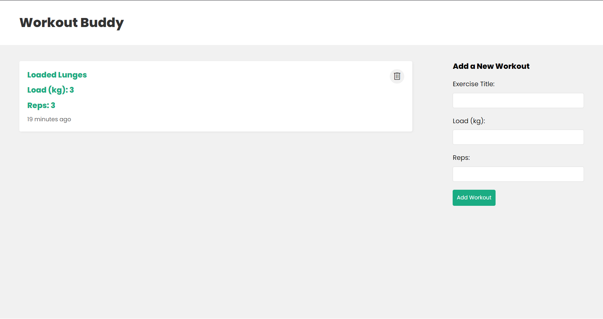

# Exercise Logger
## Reviewing the MERN (MongoDB, Express, React, Node.js) Stack


This project is a simple exercise logger that allows users to create, read, and delete exercises. It is a full-stack application that uses MongoDB for the database, Express for the backend server, React for the frontend, and Node.js for the runtime environment. 

The project uses axios to make HTTP requests to the backend server instead of the fetch API.

## Instructions
1. Clone the repository
2. Install dependencies using `npm install`
3. Create a `.env` file in the `Backend` directory and add the following:
```
PORT = <PORT NUMBER>
MONGODB_URI = <MONGO DB CONNECTION STRING>
```
4. Change the `URL_PATH` variable in `Frontend/src/pages/Home.js` and `Frontend/src/components/WorkoutForm.js` to the backend server's URL
5. Run the backend server using `npm run dev` in the `Backend` directory
6. Run the frontend server using `npm start` in the `Frontend` directory

## Resources
- Net Ninja's MERN Stack Tutorial: https://www.youtube.com/playlist?list=PL4cUxeGkcC9iJ_KkrkBZWZRHVwnzLIoUE